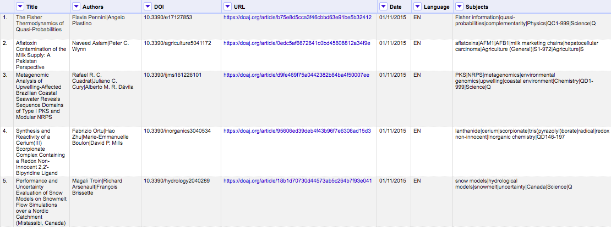

## Spreadsheets

In libraries, spreadsheets are often created to keep lists of a variety of things from keeping an inventory of items to reviewing and selecting resources (See _[What are some of the uses for SQL in libraries?]({ page.root }). Spreadsheets, otherwise known as tabular data or flat files, are an easy way to list out data organized by columns and rows. Column headers describe the data contained in corresponding columns. Each row is a record with data about it contained in separate column cells.

Spreadsheets can make data gathering easier but they can also lead to messy data.

>## Identifying inconsistencies in spreadsheet data
>
> In the figure below, can you identify where inconsistencies in the data have been introduced?
>
> 
>
> > ## Answers
> > 1. The data in the "Language" column is formatted in two ways, as an abbreviation and the full word;
> > 2. The full names of authors are used, in first name to last name order, with middle name abbreviated, separated by pipes;
> > 3. Date format is MM/DD/YYYY and not the commonly used ISO 8601 format; 
> > 4. The "Subjects" column delimits data by pipes and the data is in a variety of formats such as abbreviations, classifications, and sometimes capitalised. 
> > **Can you spot anything else?**
> {: .solution}
{: .challenge}

Over time, if you gather enough data in spreadsheets, you are likely to end up with inconsistent data (i.e. misformatted, misspelled data). Database design can help.

## Database Design

Database design involves a model or plan developed to guide how the data can be stored, organized and manipulated. The design addresses what data must be stored, how it might be classified, and it identifies the interrelationships between the data.

## Terminology

In the [Introduction to SQL](https://librarycarpentry.org/lc-sql/01-introduction/index.html) lesson, we introduced the "fields", "records", and "values" terminology. These terms are commonly used in databases while the "columns", "rows", and "cells" terms are more common in spreadsheets. Fields store a single kind of information (text, integers, etc.), records are a set of fields containing specific values.

To design a database, we must first decide what kinds of things we want to represent as tables. A table is the physical manifestation of an "entity". An entity is the conceptual representation of the thing we want to store in the database. An entity has "attributes" that describe it. For example, an article or a journal is an entity. Attributes would be things like the article title, or journal ISSN.  

In order to design a database, it is useful to describe on an abstract level the entities we would like to capture along with how the different entities are related to each other. We do this using and entity relationship diagram (ER diagram or ERD).

## Entity Relationship Diagram (ER Diagram or ERD)

ERDs are helpful tools for visualising and structuring your data more efficiently. They allow you to map relationships between concepts and ultimately construct a relational database. The following is an ERD of the database used in this lesson:

*Or you can view the [dbdiagram.io interactive version of the ERD]([dbdiagram.io](https://dbdiagram.io/d/5cc32b0cf7c5bb70c72fc530))*

Relationships between entities and their attributes are represented by lines linking them together. For example, the line linking journals and publishers is interpreted as follows: The 'journals' entity is related to the 'publishers' entity through the attributes 'PublisherId' and 'id' respectively.

Conceptually, we know that a journal has only one publisher but a publisher can publish many journals. This is known as a one-to-many relationship. In modeling relationships, we usually assign a unique identifier to the 'one' side of the relationship and use that same identifier to refer to that entity on the 'many' side. In 'publishers' table, the 'id' attribute is that unique identifier. We use that same identifier in the 'journals' table to refer to an individual publisher. That way, there is an unambiguous way for us to distinguish which journals are associated with which publisher in a way that keeps the integrity of the data (see the Normalization section below).

## More Terminology
Using the journals-publishers example, in database terms, the 'id' attribute in 'publishers' is known as the primary key (PK) and the 'PublisherId' attribute is known as the foreign key (FK). In additon to one-to-many relationships (sometimes indicated as 1 to * or 1 to ∞ but there are other notations too), another common relationship is the many-to-many relationship. The degree of relationship between entities is known as their 'cardinality'.

## Normalisation

ERDs are helpful in normalising your data which is a process that can be used to create tables and establish relationships between those tables with the goal of eliminating redundancy and inconsistencies in the data. 

In the example ERD above, creating a separate table for publishers and linking to it from the journals table via PK and FK identifiers allows us to normalise the data and avoid inconsistencies. If we used one table, we could introduce publisher name errors such as misspellings or alternate names as demonstrated below.

There are a number of normal forms in the normalisation process that can help you reduce redundancy in database tables. [Study Tonight](https://www.studytonight.com/dbms/database-normalization.php) features tutorials where you can learn more about them.  

>## Identifying remaining inconsistencies in the ERD
>
> Are there other tables and relationships you can create to further normalise the data and avoid inconsistencies?
>
> For this exercise, you can either use pencil/pen and paper to draw new tables and relationships or use [dbdiagram.io](https://dbdiagram.io/d/5cc32b0cf7c5bb70c72fc530) to modify the ERD above.
>
> > ## Answers
> > 1. An 'authors' table can be created with a many-to-many relationship with the 'articles' table and an [associative entity](https://en.wikipedia.org/wiki/Associative_entity) or bridge table between them.
> > 2. A 'subjects' table can be created with a many-to-many relationship with the 'articles' table and a bridge table between them.
> > **Can you spot anything else?**
> {: .solution}
{: .challenge}

Additional database design tutorials to consult from Lucidchart:

* [Database Structure and Design Tutorial](https://www.lucidchart.com/pages/database-diagram/database-design)
* [What is an Entity Relationship Diagram](https://www.lucidchart.com/pages/er-diagrams)
