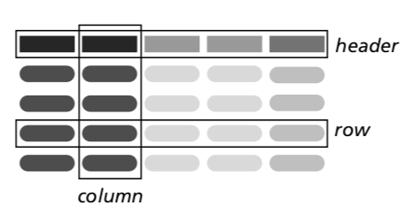

## Spreadsheets

In libraries, spreadsheets are often created to keep lists of a variety of things from keeping an inventory of items to reviewing and selecting resources (See _[What are some of the uses for SQL in libraries?](/lc-sql/01-introduction/)_). Spreadsheets, otherwise known as tabular data or flat files, are an easy way to list out data organized by columns and rows. Column headers describe the data contained in corresponding columns. Each row is a record with data about it contained in separate column cells.

_Hooland, S. & Verborgh, R. (2015). Modelling In Linked data for libraries, archives and museums : how to clean, link and publish your metadata (p. 16). London: Facet Publishing._

Spreadsheets can make data gathering easier but they can also lead to messy data. 

>## Identifying inconsistencies in spreadsheet data
>
> In the figure below, can you identify where inconsistencies in the data can be introduced?
>
> 
>
> > ## Answers
> > 1. The data in the "Language" column is formatted in two ways, as an abbreviation and the full word;
> > 2. The full names of authors are used, in first name to last name order, with middle name abbreviated, separated by pipes;
> > 3. Date format is MM/DD/YYYY and not the commonly used ISO 8601 format; 
> > 4. The "Subjects" column delimits data by pipes and the data is in a variety of formats such as abbreviations, classifications, and sometimes capitalised. 
> > **Can you spot anything else?**
> {: .solution}
{: .challenge}

Over time, if you gather enough data in spreadsheets, you are likely to end up with inconsistent data (i.e. misformatted, misspelled data). Database design can help.

## Database Design

Database design involves a model or plan developed to guide how the data can be stored, organized and manipulated. The design addresses what data must be stored, how it might be classified, and it identifies the interrelationships between the data.   

## Entity Relationship Diagram (ER Diagram or ERD)

ERDs are helpful tools for visualising and structuring your data more efficiently. They allow you to map relationships between concepts and ultimately construct a relational database. The following is an ERD of the database used in this lesson:

Concepts such as articles or journals are called 'Entities' and are represented as tables. An entity can have 'Attributes' or columns that describe it, for instance, an article title or a journal ISSN, which are listed in the entity table. Relationships between entities and their attributes are represented by lines linking them together. They are linked by primary and foreign keys. A primary key, or PK, uniquely identifies a record in a table and is noramlly named 'id', short for identifier. A foreign key, or FK, is a reference to a primary key from another table. In the ERD above, 'PublisherId' is a foreign key in the 'journals' table which is linked to the 'publishers' table and 'id' attribute which is a primary key. The degrees of relationship between entities, also known as 'cardinality', can either be one-to-one, one-to-many or many-to-many. Again, using the example above, a publisher can have many journals, so the relationship is noted as one-to-many or '1' to '*'.

## Normalisation

ERDs are helpful in normalising your data which is a process that can be used to create tables and establish relationships between those tables with the goal of eliminating redundancy and inconsistencies in the data. Normalisation is a multi-step process which follows a number of rules:

1. First Normal Form
2. Second Normal Form
3. Third Normal Form
4. BCNF
5. Fourth Normal Form

### First Normal Form (1NF)

* Rule 1 - Each column should contain atomic values. The Subject column violates this rule as it lists multiple entries separated by a comma. 
* Rule 2 - A column should contain values that are the same type. The Journal column violates this rule as Date and Text types are inter-mixed.
* Rule 3 - Each column should have a unique name. So having two "ISSN" columns violates this rule.
* Rule 4 - The order of the data does not matter as SQL can be used to fetch data in any order from the table.

| Title                                                              | Language | ISSN | ISSN      | Subjects                                                                                                       | Journal    |
|--------------------------------------------------------------------|----------|------|-----------|----------------------------------------------------------------------------------------------------------------|------------|
| The Fisher Thermodynamics of Quasi-Probabilities                   | 1        | 1099 | 1099-4300 | `Fisher information|quasi-probabilities|complementarity|Physics|QC1-999|Science|Q`                               | Entropy    |
| Aflatoxin Contamination of the Milk Supply: A Pakistan Perspective | 1        | 2077 | 2077-0472 | `aflatoxins|AFM1|AFB1|milk marketing chains|hepatocellular carcinoma|Agriculture (General)|S1-972|Agriculture|S` | 2015-11-01 |
|                                                                    |          |      |           |                                                                                                                |            |

### Second Normal Form (2NF)
* Rule 1 - 1NF rules are followed. 
* Rule 2 - Data redundancy is reduced through creating separate tables via primary and foreign key relationships. The Language column and the Languages tables demonstrate this. 

| ID | Language | Abbreviation |
|----|----------|--------------|
| 1  | English  | EN           |
| 2  | French   | FR           |

[Study Tonight](https://www.studytonight.com/dbms/database-normalization.php) features tutorials that cover the forms described above along with the additional forms not covered.  

>## Identifying remaining inconsistencies in the ERD
>
> Are there other tables and relationships you can create to further normalise the data and avoid inconsistencies?
>
> For this exercise, you can either use pencil/pen and paper to draw new tables and relationships or use [dbdiagram.io](https://dbdiagram.io/d/5cc32b0cf7c5bb70c72fc530) to modify the ERD above.
>
> > ## Answers
> > 1. An 'authors' table can be created with a many-to-many relationship with the 'articles' table and an [associative entity](https://en.wikipedia.org/wiki/Associative_entity) or bridge table between them.
> > 2. A 'subjects' table can be created with a many-to-many relationship with the 'articles' table and a bridge table between them.
> > **Can you spot anything else?**
> {: .solution}
{: .challenge}

Additional database design tutorials to consult from Lucidchart:

* [Database Structure and Design Tutorial](https://www.lucidchart.com/pages/database-diagram/database-design)
* [What is an Entity Relationship Diagram](https://www.lucidchart.com/pages/er-diagrams)
